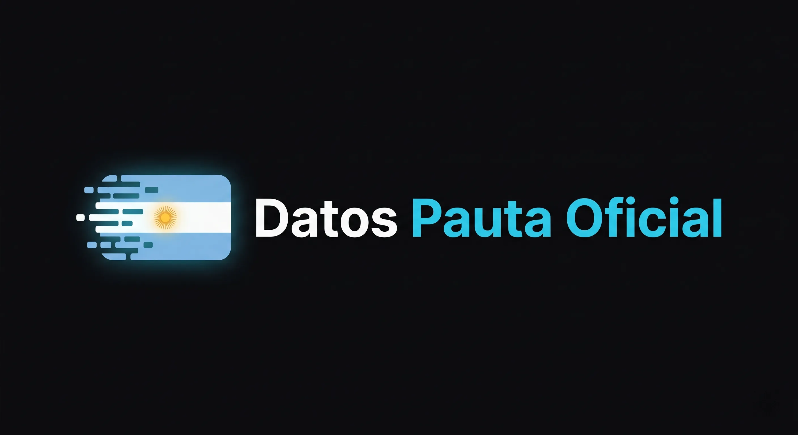

<p align="center">
  
</p>

# Datos Pauta Oficial — Publicidad Oficial Argentina en un Solo Lugar

🌐 **Deploy en producción:** [datospautaoficial.com.ar](https://datospautaoficial.com.ar)

Web pública, neutral y open source que consolida los datos de publicidad oficial (pauta) de Argentina en un solo lugar: **540.413 órdenes de publicidad** de cuatro jurisdicciones (Nación, CABA, Provincia de Buenos Aires y Santa Fe), período 2003–2025, con montos deflactados por inflación para que las cifras sean comparables entre años.

**Es la única web que existe que hizo esto.** No hay otro sitio ni medio que haya consolidado, normalizado y publicado estos datos de forma unificada y consultable. La postura es estrictamente informativa: sin denuncia ni opinión.

---

## 🔍 El diferencial: datos que no existían en ningún otro lado

**Ninguna otra web unificó los datos de pauta oficial argentina en un solo lugar.** Hasta este proyecto, la información estaba dispersa en portales de datos abiertos, planillas y PDFs de cada jurisdicción, con formatos incompatibles entre sí y sin posibilidad de comparar montos entre años o gobiernos.

**Además, PBA 2020–2024 es un dataset exclusivo de este proyecto.** La Provincia de Buenos Aires no publica sus órdenes de publicidad en datasets abiertos para ese período: la información estaba enterrada en resoluciones individuales en PDF. Mediante un script programado fui extrayendo los datos **resolución por resolución — más de 500 resoluciones procesadas** — para reconstruir el detalle de cada orden (proveedor, medio, monto, expediente). Ninguna otra web ni medio tiene estos datos.

---

## 📊 Cobertura de datos

| Jurisdicción | Período | Órdenes |
|---|---|---|
| Nación | 2009–2022 | 225.367 |
| CABA | 2003–2024 | 209.877 |
| Santa Fe | 2008–2023 | 61.187 |
| PBA | 2020–2025 | 43.982 |
| **Total** | **2003–2025** | **540.413** |

Los huecos de cobertura se muestran de forma explícita en la web: nunca se presentan agregados que puedan engañar por cobertura incompleta.

---

## 🏗️ Arquitectura

El proyecto corre **100% sin backend ni servidores**: la base de datos SQLite completa (~173 MB) vive en Cloudflare R2 partida en chunks, y el navegador consulta solo los bytes que necesita vía HTTP Range Requests gracias a `sql.js-httpvfs`. Costo operativo: prácticamente cero.

```text
Fuentes oficiales (CSV / Excel / PDF por jurisdicción)
↓
Extractores Python (etl/extractores/extract_{caba,nacion,pba,santa_fe}.py)
↓
unificar.py → CSV canónico (8 columnas, 540.413 filas) → validar.py
↓
build_db.py → SQLite deflactada (IPC INDEC) + caches precomputados
(totals_cache, rankings_cache, groups_cache, home.json)
↓
Chunks de 20 MiB en Cloudflare R2 (db.datospautaoficial.com.ar)
↓
Astro + React islands → consultas SQL desde el navegador (sql.js-httpvfs)
↓
Cloudflare Pages (datospautaoficial.com.ar)
```

---

## 🛠️ Stack Tecnológico

| Capa | Tecnología |
|------|------------|
| **ETL** | Python (extractores modulares por jurisdicción, unificación, validación) |
| **Base de datos** | SQLite estática, consultada desde el browser con `sql.js-httpvfs` |
| **Framework** | Astro 6 (static output) + React 19 (islands) |
| **Lenguaje** | TypeScript |
| **Búsqueda** | MiniSearch (índice client-side de proveedores y medios) |
| **Hosting** | Cloudflare Pages + Cloudflare R2 (chunks de la DB) |
| **Deflactación** | IPC INDEC (+ serie Eco Go 2007–2015), montos a pesos constantes |

---

## 🎯 Funcionalidades

**Tabla explorable de 540 mil órdenes**
- Filtros cruzados por jurisdicción y año, agrupación por proveedor/medio con filas expandibles y paginación de 25 registros por página
- Primer paint instantáneo: el estado inicial viene precomputado e inlineado por Astro (`home.json`) — sql.js se inicializa recién cuando el usuario interactúa
- El dato mostrado es el **crudo exacto de la fuente oficial**, sin normalización

**"Cuánto recibió" — buscador de entidades**
- Toggle ternario Proveedor / Medio / **Grupo mediático**: el modo grupo consolida las razones sociales de cada holding según el [Media Ownership Monitor Argentina](https://argentina.mom-gmr.org/), con panel de transparencia y disclaimer
- Imagen PNG 1080×1080 descargable para compartir en redes, generada con Canvas API puro, sin dependencias
- Deeplinks compartibles que restauran entidad, modo y año

**Rankings**
- Top de proveedores, medios y grupos mediáticos por jurisdicción y año, servidos desde caches precomputados en el build (sin scans sobre la tabla principal)

**Compartir web**
- Botón en el navbar (desktop e integrado en el menú hamburguesa en mobile) con dos opciones: compartir directamente en X o copiar el link al portapapeles

**Página de metodología**
- Fuentes, criterios de deflactación y de normalización documentados públicamente

---

## 🧮 Decisiones de datos

- **Montos deflactados, no nominales.** Todos los montos están expresados en pesos constantes (IPC INDEC). Comparar pauta de 2009 con la de 2024 en pesos nominales no tiene sentido en Argentina.
- **Sin normalización en la tabla, normalización transparente en agregados.** La tabla muestra el dato exacto de la fuente. Los rankings y "Cuánto recibió" aplican solo unificación de variantes de escritura de la misma razón social (`aliases.csv`, curado conservador). La consolidación por propiedad (grupos mediáticos) es un toggle opcional, separado y con fuente citada.
- **Honestidad sobre los huecos.** Cada limitación de la fuente (filas sin fecha, períodos parciales) se documenta en vez de ocultarse.

---

## 📝 Notas de Desarrollo

Desarrollo apoyado fuertemente en IA a lo largo de todo el ciclo: como motor para acelerar la producción, como segunda opinión ante decisiones técnicas y como complemento de conocimiento en áreas fuera de mi expertise.

---

## 👤 Autor

**Iván Gómez Dell'Osa**

- Email: [ivangomezdellosa@gmail.com](mailto:ivangomezdellosa@gmail.com)
- LinkedIn: [linkedin.com/in/ivangomezdellosa](https://www.linkedin.com/in/ivangomezdellosa/)
- GitHub: [IvanGomezDellOsa](https://github.com/IvanGomezDellOsa)
